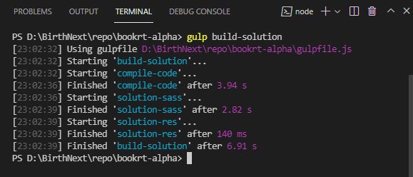
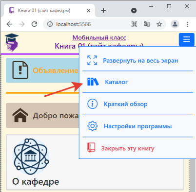
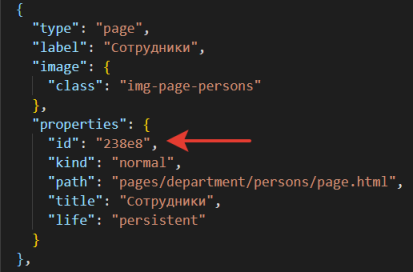

# BookRT-Alpha

The Textbooks Runtime System


# От автора (версия 0.1.0)

Проект BookRT-Alpha является первой результативной попыткой переноса в мир веба программной системы управления виртуальными книгами/учебниками, ранее реализованной мною в двух десктоп-проектах: "Учебно-тестовая система" и "Интерактивная библиотека". Обе программы (пройдя некоторую эволюцию развития) показали высокую практическую эффективность при обучении иностранных студентов на подготовительном факультете Воронежского государственного университета и при использовании частными лицами, изучающими русский язык за рубежом. Многие идеи комплексного подхода к подаче интерактивного учебного материала (даже не доведённые мной до задуманного состояния) получили высокую оценку представителей наших и зарубежных вузов, а ряд специализированных возможностей, таких как средства работы с песнями и некоторые разновидности лингвотренажёров — вообще не имеют аналогов ни в одной известной мне программной разработке для образовательной сферы. Но со стремительным развитием Интернета и массовым распространением планшетных компьютеров и смартфонов, а также ростом популярности дистанционного обучения, разработка десктоп-приложений для образовательных целей потеряла практическую ценность и стало ясно, что пора осваивать новые технологии.

Попытку реализовать под веб хотя бы что-то похожее на то, что было сделано мною ранее для работы в компьютерных классах, я начал имея смутное представление о том — как вообще это можно сделать, вооружившись такими скудными на первый взгляд средствами как JavaScript и HTML!? Веб разработка не является для меня профильной деятельностью, а создание программных систем, работающих в браузерной среде, вообще ещё относительно новое направление в программировании с неустоявшимися стандартами и подходами, да к тому же с немалыми отличиями (если не сказать принципиальными) от подходов к разработке традиционных сайтов (о чём я имел хотя бы какие-то начальные представление).

После некоторых раздумий и экспериментов я решил начать разработку новой системы с "чистого листа", т.е. без использования популярных веб-фреймворков таких как Angular, React, Vue и т.п. Все они, в той или иной степени, навязывают свою специфическую модель построения приложения и тянут за собой шлейф балласта, который возможно вообще никогда не понадобится. Если смутно представляешь конечную цель, опасно попадать в зависимость от какой-либо малоизученной программной архитектуры (а на реальное освоение любого из этих фреймворков могут уйти годы), поскольку есть вероятность того, что на определённом этапе своей разработки можно просто зайти в идейный или технический тупик.

К сожалению, опыт создания настольных приложений оказался малопригодным в новой веб-парадигме, за исключением разве что интуиции. Некоторые идеи того, как вообще можно применить объектно-ориентированную концепцию к построению программной системы на языке JavaScript, мне удалось почерпнуть, изучая код сейчас уже забытого фреймворка WinJS целью которого была первая реализация metro-интерфейса Windows 8. Я был приятно удивлён объектно-ориентированной архитектурой программной системы работающей в браузере, созданной командой из Майкрософта ещё в 2011-2012 году. Но всё же от чистого JavaScript я в итоге отказался. Как разработчику на C++ и C# мне показался более привлекательным быстро набирающий популярность в мире веба язык TypeScript.

В итоге, после нескольких неудачных заходов всё же удалось свести концы с концами и выстроить более-менее рабочую архитектуру своей системы, состоящую из трёх уровней:  
`engine` — ядро, в котором реализован механизм загрузки и парсинга виртуальных учебников, управление контентом и другие сервисные механизмы;  
`libs` — библиотеки расширения, позволяющие динамически добавлять новые типы контента (отображаемого на страницах книг), реализуемые в виде "контролов"(виджетов) на языке TypeScript;  
`shell` — интерфейсная оболочка, выступающая в качестве главного окна программы.

Изначально я решил сделать ядро системы независимым от каких-либо сторонних библиотек, даже от так всеми любимого jQuery, поэтому пришлось реализовывать собственные механизмы для "всего на свете": включая локализацию строк, различные сервисы, динамические загрузки данных и т.п. Единственная сторонняя библиотека которую я использовал для реализации пользовательского интерфейса это Bootstrap 5. Данная библиотека/фреймворк работает исключительно на уровне визуальных стилей и не навязывает никакой программной архитектуры (хотя Bootstrap всё же использует jQuery для своих нужд).

В проекте также присутствует папка `third-party`, в которой находятся программные библиотеки сторонних разработчиков, используемые для поддержки учебного материала. Они не связаны с ядром программы, а обращение к ним идёт из библиотек расширения (папка `libs`). Пока задействованы только две таких библиотеки:  
[MathJax](https://www.mathjax.org/) — отображение математических формул;  
и  
[H5P Standalone Player](https://github.com/tunapanda/h5p-standalone) — плеер для автономной работы с интерактивным контентом в формате [H5P](https://h5p.org/).

Соответственно, выражаю особую благодарность разработчикам этих полезных решений с открытым программным кодом!

На данный момент я рассматриваю состояние системы как работающий прототип с рассчётом на его дальнейшее развитие в архитектурном и функциональном направлениях. Ещё много чего не сделано. Очень не хватает механизма авторизации без которого невозможен индивидуальный анализ прогресса учащегося. Так же ещё не разработаны собственные элементы(контролы) реализующие различные типы учебного материала (пока что можно воспользоваться возможностями предлагаемыми сервисом H5P). Нет специализированного редактора или билдера для создания хотя бы каркаса виртуальных учебников, а в идеале и их наполнения контентом. Очевидно, что эти задачи и будут определять направление деятельности на ближайшую перспективу...


# Подготовка и запуск

Подготовка программной системы к запуску на локальном компьютере или переносу на сервер максимально упрощена по сравнению с традиционным подходом к архитектуре и сборке веб-приложений средствами таких технологий как [webpack](https://webpack.js.org/), [Grunt](https://gruntjs.com/) и подобных (личное мнение автора). 

Файловая структура проекта фактически имеет законченный (для запуска) вид, за исключением двух папок:

- `code` — содержит выполняемый код программной системы BookRT-Alpha (результат компиляции содержимого папки `src`);
- `node_modules` — сторонние программные библиотеки, используемые ядром системы.

> Указанные папки необходимо сбилдовать перед началом использования системы. Как это сделать поясняется далее.

*От автора. При работе над этим проектом я использовал редактор [Visual Studio Code](https://code.visualstudio.com/), поэтому все дальнейшие рекомендации будут делаться исходя из этого. При использовании других средств разработки, можно действовать по аналогии*.


## Конфигурация рабочей среды

### На компьютере должны быть установлены:

- Программная платформа [Node.js](https://nodejs.org/en/);

- Таск-менеджер [Gulp.js](https://gulpjs.com/). Установить Gulp из консоли можно след. образом:
	```
	npm install --global gulp-cli
	```

- Редактор — [Visual Studio Code](https://code.visualstudio.com/);

- Компилятор языка TypeScript. Установить компилятор из консоли можно след. образом:
  ```
  npm install -g typescript
  ```
  (см. документацию к VS Code: [TypeScript in Visual Studio Code](https://code.visualstudio.com/docs/languages/typescript)).

### Не обязательно, но желательно в VS Code должно быть установлено следующее расширение:

- [Live Server](https://marketplace.visualstudio.com/items?itemName=ritwickdey.LiveServer).


## Сборка проекта

### 1. `node_modules`

Первым делом необходимо сбилдовать папку `node_modules`, для этого выполните в терминале следующую команду:
```
npm install
```

Из внушительного содержимого папки `node_modules`, полученного в результате инсталляции, в действительности понадобится только следующее:  
```
@types  
bootstrap  
bootstrap-icons  
jquery  
gulp  
gulp-autoprefixer  
gulp-cli  
gulplog  
gulp-sass
```
и то, всё что относится к "Gulp" нужно только для билдовки кода, а не для его работы.

### 2. Исполняемый код

Весь исходный код системы и связанные с ним ресурсные данные находятся в папке `src`. Для сборки проекта необходимо выполнить следующее:  
— Создать папку `code` в корне проекта;  
— Скомпилировать файлы TypeScript (\*.ts) в файлы JavaScript (\*.js), с переносом их в папку `code` в точном структурном соответствии с папкой `src`;  
— Скомпилировать все файлы Sass (\*.scss) в файлы CSS (\*.css) с переносом их в точном структурном соответствии в папку `code`;  
— Перенести все остальные файлы (ресурсные данные) из папки `src` в папку `code` в точном структурном соответствии.  

Все эти действия выполняет Gulp-задача(скрипт) с именем `build-solution`. Для запуска задачи выполните в терминале команду:
```
gulp build-solution
```
*(исполняемый код gulp-задач находится в файле `gulpfile.js`)*  

После завершения билдовки проекта терминал должен выглядеть примерно так:  


После этого программа готова к запуску.

Примечание. Запускать gulp-задачи можно и через интерфейс Visual Studio Code (см. [Integrate with External Tools via Tasks](https://code.visualstudio.com/docs/editor/tasks)).  


## Запуск

### На локальном компьютере

Для локального запуска системы необходимо использование какого-либо локального сервера. Наиболее простым решением для Visual Studio Code является [Live Server](https://marketplace.visualstudio.com/items?itemName=ritwickdey.LiveServer), устанавливаемый в виде расширения к редактору.  

В конфигурационном файле `.vscode/settings.json` находятся настройки расширения Live Server, включающие параметр `liveServer.settings.NoBrowser` установленный в `true`. Т.е. при запуске Live Server (каким-либо образом, н-р: из палитры команд `Live Server: Open with Live Server`) браузер автоматически не открывается. Это надо сделать вручную: открыть браузер и ввести в его адресную строку локальный адрес приложения (для порта 5588 это будет `http://127.0.0.1:5588`) или запустить приложение в режиме отладки клавишей `F5`. При желании, для автоматического открытия браузера, параметр `liveServer.settings.NoBrowser` можно изменить на `false` или просто удалить.

Более подробно про использование Live Server см. [Live Server | VSCode Extension](https://ritwickdey.github.io/vscode-live-server/docs/settings.html).

### На сервере

После сборки проекта (см. выше) достаточно будет перенести в любую доступную на сервере директорию следующее:

> _storage  
> app  
> code  
> config  
> node_modules  
> third-party  
> index.html

после чего можно запустить систему по внешней ссылке, например: `https://phys.vsu.ru/mphit/` (здесь `mphit` — директория размещения системы на сервере). Соответственно запуск будет осуществлён с файла `index.html`.


## Отладка

Для возможности отладки программы в Visual Studio Code необходимо установить расширение [Debugger for Chrome](https://marketplace.visualstudio.com/items?itemName=msjsdiag.debugger-for-chrome).

В папке `.vscode` находятся файлы конфигурации в которых: расширения **Live Server** и **Debugger for Chrome** настроены на порт `5588` (`settings.json` и `launch.json` соответственно), при желании все настройки можно изменить на своё усмотрение.

Более подробно про отладку TypeScript кода см. [Debugging TypeScript](https://code.visualstudio.com/docs/typescript/typescript-debugging).


# Виртуальные книги

В папке `_storage` находятся две вложенные папки:  
`books` — содержит папки виртуальных книг;  
`catalog` — содержит файл каталога, содержащего ссылки на виртуальные книги и другую сопроводительную информацию.  

После запуска и инициализации, программная система ищет в конфигурационном файле `app/app-cfg.json` параметр `start`, содержимое которого рассматривается как относительный от `_storage/books` путь к папке книги открываемой при старте. Другие книги могут быть открыты через пользовательский интерфейс каталога или по прямой URL ссылке.  


### Каталог

Окно каталога открывается следующим образом:  

  

Каталог не обязательно должен содержать ссылки на все книги, установленные в системе. Ссылки на книги из каталога могут быть только относительными: корневая папка `_storage/books`. В случае если книга не указана в каталоге, открыть её можно либо при запуске системы, через параметр `start` файла `app/app-cfg.json`, либо по прямой ссылке (см. далее).


### Прямая URL ссылка

Для получения прямой ссылки на нужную книгу необходимо добавить к интернет-адресу программной системы дополнительный параметр. Возможны два варианта:  
1) `?path=локальный_путь_к_папке`  
например: `https://vmbtime.com/bookrt/?path=book-02`  

2) `?book=идентификатор_книги` 
например: `https://vmbtime.com/bookrt/?book=a8d8afc-01`  

    Примечание. Идентификатор книги должен быть указан в файле каталога.  

Для получения прямой ссылки на конкретную страницу книги, к URL адресу, указывающему на книгу, надо добавить ещё один параметр содержащий идентификатор страницы.  
например: `https://vmbtime.com/bookrt/?path=book-02&page=688A5`

Примечание. Идентификаторы страниц прописываются в файле `book/main.json` например:

  


# Контактная информация
Страница автора в социальной сети "ВКонтакте": [https://vk.com/gc_neostandart](https://vk.com/gc_neostandart)  
Электронный адрес: neostandart@live.ru  

